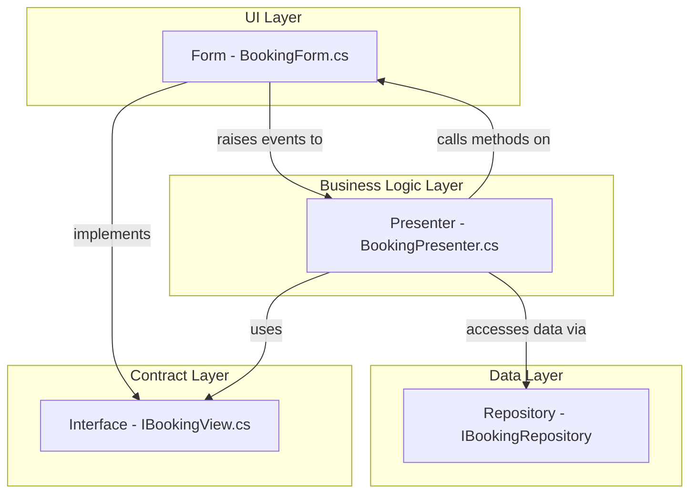

# Hotel Management System

## Update database

```bash
# Use Package Manager Console in Visual Studio
# First, remove existing migrations if any
Remove-Migration -Force
# Then, add a new migration
Add-Migration [name] -OutputDir Data/Migrations
# Finally, update the database
Update-Database
```

## Người 1 – **Accounts** (USER_TYPE, USER, ROLE, PROFILE)

**Form chính (5):**

1. **LoginForm** (đăng nhập + “Remember me”/đổi mật khẩu nhỏ)
2. **UsersForm** (CRUD USER) – tab “Profile” để sửa PROFILE cùng chỗ
3. **RolesForm** (CRUD ROLE) – gán/thu hồi role cho user
4. **UserTypesForm** (CRUD USER_TYPE)
5. **ChangePasswordDialog** (dialog)

> DoD: băm mật khẩu, validate email/phone, phân quyền bật/tắt menu theo ROLE/USER_TYPE.

---

## Người 2 – **Booking & Billing** (BOOKING, BOOKING_PARTICIPANT, INVOICE, PARAMS)

**Form chính (6):**

1. **BookingsForm** (list + tạo/sửa/hủy)
2. **CheckInDialog** (từ booking)
3. **CheckOutDialog** (khóa bill, sinh invoice)
4. **BookingParticipantsDialog** (thêm/xóa người ở – bảng BOOKING_PARTICIPANT)
5. **InvoicesForm** (xem/in hoá đơn; liên kết booking)
6. **ParamsForm** (CRUD PARAMS – cấu hình DayRent, phụ phí, …)

> DoD: kiểm tra phòng trống theo ngày, không cho overlap; tổng tiền = (đơn giá x đêm) ± surcharge; trạng thái booking/invoice cập nhật đúng.

---

## Người 3 – **Inventory & Revenue** (ROOM_TYPE, ROOM, PAYMENT, MONTH_REVENUE, MONTH_REVENUE_DETAIL)

**Form chính (6):**

1. **RoomTypesForm** (CRUD ROOM_TYPE)
2. **RoomsForm** (CRUD ROOM) – trạng thái: Available/Occupied/Cleaning…
3. **PaymentsForm** (ghi nhận thanh toán cho INVOICE; hoàn tiền nếu cần)
4. **RevenueMonthlyReportForm** (MONTH_REVENUE – tổng doanh thu theo tháng)
5. **RevenueByRoomTypeReportForm** (MONTH_REVENUE_DETAIL – doanh thu theo loại phòng)
6. **DashboardForm** (màn chính/MDI: ô trạng thái phòng, doanh thu tháng, booking hôm nay)

> DoD: export PDF/Excel; filter theo tháng/phòng; Payment liên kết Invoice, validate số tiền.

---

## Gợi ý để làm độc lập (tránh đụng nhau)

* Đóng băng **DTO + Service Interfaces** theo nhóm:

  * `IAuthService, IUserService, IRoleService, IUserTypeService`
  * `IBookingService, IInvoiceService, IParamsService`
  * `IRoomService, IRoomTypeService, IPaymentService, IRevenueService`
* Mỗi người tự tạo **FakeService** (in-memory) để phát triển UI trước; cuối cùng cắm repo Dapper.
* Menu điều hướng: mỗi người sở hữu mục của mình; Người 1 làm **Login + bật/tắt menu theo quyền**.

Tổng quan, mỗi người ~5–6 form, khối lượng cân bằng và bám sát ERD bạn đưa.

## Kiến trúc UI (MVP Pattern)

- `Views/`: (INTERFACE) UserControl, interface View (ILoginView, IRoomsView...)
  + Contracts/Interfaces that define what a UI component should be able to do
  + They describe the capabilities and data that the UI must provide
  + They are UI-agnostic - they don't care if it's WinForms, WPF, Web, etc.
- `Presenters/`: (CLASS) Presenter for each View (ILoginPresenter, IRoomsPresenter...)
  + Business logic controllers that coordinate between Views and Models
  + They contain the application logic, validation, and data processing
  + They are UI-independent - they work with any UI that implements the View interface
- `Forms/`: (IMPLEMENTATION) LoginForm.cs, RoomsForm.cs (Designer + resx).
  + Concrete implementations of the View interfaces using Windows Forms
  + They handle the actual UI rendering, user interactions, and visual appearance
  + They implement the View interfaces
- Illustration of relationships:

